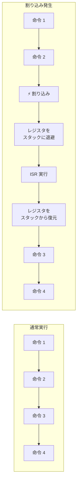
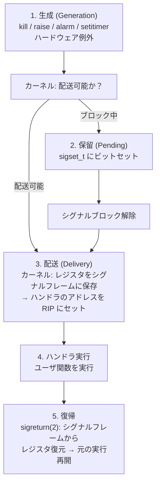

# OS の「ソフトウェア割り込み」Signal を C で深く学ぶ（Linux / macOS）

**ソフトウェアエンジニア向けの POSIX シグナル学習教材。**
OS カーネルが提供する「非同期通知機構」であるシグナルを、10 個の段階的なサンプルプログラムで徹底解剖します。ハードウェア割り込み（HW IRQ/ISR）との構造的類似性を軸に、なぜシグナルが「ソフトウェア割り込み」と呼ばれるのかを体得します。

> **核心**: シグナルは「OS カーネルがユーザプロセスに送るソフトウェア割り込み」です。HW 割り込みと対応する構造 — 割り込みベクタとシグナル番号、ISR とシグナルハンドラ、割り込み禁止とシグナルマスク — を C コードで可視化します。ただし両者は実装レベルでは同一ではなく、構造的・概念的な類似関係として捉えます。

---

## TL;DR（3 行で）

1. **シグナルは OS の「非同期割り込み」**。プロセスが自分の意思に関わらず外部から通知を受け取る唯一の標準的な仕組み。
2. **HW 割り込み ISR とシグナルハンドラは構造的に類似** — どちらも「実行中のコンテキストを保存 → ハンドラ実行 → 元のコンテキストへ復帰」のパターンを持つ。
3. **10 個の段階的サンプル**で、`signal()`/`sigaction()`/`sigprocmask()`/`sigaltstack`/リアルタイムシグナルまで体系的に学べる。`make && ./01_signal_basics` から始める。

> **表記方針**: 本教材の解説文（この README や出力メッセージ）は**日本語**、サンプルコード内の**コメントは英語**で統一しています。C 製のプロダクションコードで英語コメントを読み書きする練習も兼ねています。

---

## 目次

1. [学習の到達目標](#学習の到達目標)
2. [前提知識: 割り込みとは何か](#前提知識-割り込みとは何か)
3. [シグナルの本質: ソフトウェア割り込み](#シグナルの本質-ソフトウェア割り込み)
4. [HW 割り込みとシグナルの構造的対応](#hw-割り込みとシグナルの構造的対応)
5. [シグナルのライフサイクル](#シグナルのライフサイクル)
6. [シグナル番号一覧と分類](#シグナル番号一覧と分類)
7. [コア API 群](#コア-api-群)
8. [サンプルプログラム一覧](#サンプルプログラム一覧)
9. [コードで追う: 各サンプルの核心](#コードで追う-各サンプルの核心)
10. [Hands-on Exercises — 試してみよう](#hands-on-exercises--試してみよう)
11. [付録: EINTR と SIGCHLD](#付録-eintr-と-sigchld)
12. [難所: 非同期シグナル安全性](#難所-非同期シグナル安全性)
13. [難所: プラットフォーム差](#難所-プラットフォーム差)
14. [ビルド・実行](#ビルド実行)
15. [発展トピック: 本教材の先にあるもの](#発展トピック-本教材の先にあるもの)
16. [さらに学ぶために](#さらに学ぶために)

---

## 学習の到達目標

このリポジトリを読み終えると、次が説明できるようになります。

- **シグナルとは何か** — 「プロセスに対する非同期通知」であり、OS がプロセスに割り込む唯一の標準機構であること。
- **HW 割り込みとの構造的対応** — 割り込みベクタ番号 ↔ シグナル番号、ISR ↔ シグナルハンドラ、割り込み禁止（cli/sti）↔ シグナルマスク（`sigprocmask`）、IDT ↔ シグナルテーブル。ただし影響範囲や特権レベルは異なる。
- **シグナルのライフサイクル** — 生成（raise/kill/alarm/setitimer）→ 保留（pending）→ 配送（deliver）→ ハンドラ実行 → 復帰、の全ステップ。
- **`sigaction` が `signal()` より優れている理由** — `SA_SIGINFO` で送信元情報取得、`SA_RESTART` でシステムコール再開制御、`SA_ONSTACK` で代替スタック、マスク制御。
- **シグナルマスクの正体** — `sigprocmask` が OS の「割り込み禁止」に相当し、クリティカルセクション保護に使われること。
- **非同期シグナル安全性** — ハンドラ内で `printf`/`malloc`/`mutex` が危険な理由と、安全な関数一覧。
- **リアルタイムシグナルの価値** — キューイングと `si_value` でデータ配送ができること。
- **`sigaltstack` の必要性** — スタックオーバーフロー時に通常スタックが使えない問題と代替スタックの設計。

---

## 前提知識: 割り込みとは何か

シグナルを理解する前に、ハードウェア割り込みの基本を押さえます。割り込みは「CPU が現在実行中の命令ストリームを一時中断し、別のコード（ISR: Interrupt Service Routine）を実行する」仕組みです。



割り込みの特徴：

| 特徴           | 説明                                                                            |
|----------------|---------------------------------------------------------------------------------|
| **非同期**     | プログラムの意思に関わらず、任意のタイミングで発生する                          |
| **透過的**     | 割り込まれたコードは割り込みの発生に気づかない（レジスタが完全に保存・復元されるため） |
| **優先**       | 通常の命令実行より優先される                                                    |
| **ベクタ駆動** | 割り込み番号 → IDT → ISR のアドレスというルックアップでハンドラが決まる         |

**HW 割り込みの種類**:

| 割り込み種別         | 発生源                           | 例                                            |
|----------------------|----------------------------------|-----------------------------------------------|
| 外部割り込み (IRQ)   | I/O デバイス                     | キーボード押下、NIC パケット受信、ディスク完了 |
| タイマ割り込み       | プログラマブルタイマ (PIT/LAPIC) | スケジューラのタイムスライス切替（プリエンプション） |
| 例外 (トラップ)      | CPU 内部                         | ゼロ除算、ページフォールト、不正命令          |
| ソフトウェア割り込み | アーキテクチャ依存命令           | システムコール (`syscall` 等。`int 0x80` はレガシーな x86 32bit Linux の仕組み) |

---

## シグナルの本質: ソフトウェア割り込み

**シグナルとは「カーネルがプロセスに対して発生させるソフトウェア割り込み」**です。

- HW 割り込みが「CPU を中断して ISR を実行する」のに対し、
- シグナルは「プロセスの通常実行を中断してシグナルハンドラを実行する」

ユーザプロセスからは HW 割り込み機構（IDT、IRQ、`cli`/`sti`）に直接触れません。しかしカーネルは、**シグナルという抽象化を通じて、まったく同じ「非同期割り込み」のパターンをユーザ空間に提供**しています。

> **気づき**: `sigaction` でハンドラを登録する行為は、OS の IDT（Interrupt Descriptor Table）に ISR のアドレスを書き込むのと**概念的に対応する**操作です。IDT は CPU/システム全体のハードウェアテーブルであるのに対し、`sigaction` はプロセスごとのカーネル内テーブルを更新するシステムコールです。

---

## HW 割り込みとシグナルの構造的対応

この対応表が本教材の核心です。対応する概念を並べていますが、実装レベルでは同一ではありません。差異は表の後にまとめています。

| 概念                 | HW 割り込み（OS カーネル）            | POSIX シグナル（ユーザ空間）                                       | 備考                                       |
|----------------------|---------------------------------------|--------------------------------------------------------------------|--------------------------------------------|
| **割り込み源**       | デバイス / タイマ / CPU 例外          | `kill(2)`, `raise(3)`, `alarm(2)`, `setitimer(2)`, カーネルが CPU 例外から変換（SIGSEGV等） | シグナルはカーネルが生成する               |
| **割り込み番号**     | 割り込みベクタ番号（0-255）           | シグナル番号（1-31 標準, 通常 34-64 リアルタイム）                 | どちらも整数でハンドラをルックアップ       |
| **ハンドラテーブル** | IDT（Interrupt Descriptor Table）     | プロセスごとの `sigaction` テーブル                                | カーネル内の `task_struct.sighand`         |
| **ハンドラ**         | ISR（Interrupt Service Routine）      | シグナルハンドラ関数                                               | 割り込まれたコンテキストとは別に実行       |
| **コンテキスト保存** | CPU が自動で SS:RSP/RFLAGS/CS:RIP を push | カーネルが割り込まれた瞬間のCPUコンテキストをシグナルフレームに保存。`ucontext_t` はそれを反映する | シグナルフレームに保存される               |
| **復帰命令**         | `iret`（x86）/ `eret`（ARM）          | `sigreturn(2)`（カーネルが自動呼出）                               | 保存したコンテキストを復元して再開         |
| **割り込み禁止**     | `cli` 命令（Clear Interrupt Flag）    | `sigprocmask(SIG_BLOCK, ...)`                                      | プロセス（スレッド）単位のマスク。CPU 全体の割り込みは止めない |
| **割り込み許可**     | `sti` 命令（Set Interrupt Flag）      | `sigprocmask(SIG_UNBLOCK, ...)`                                    | プロセス（スレッド）単位のマスク           |
| **割り込み優先度**   | IRQ 優先度 (PIC/APIC)                 | 標準は優先度なし、RTシグナル間のみ FIFO                            | シグナル到着順は保証されない               |
| **割り込みネスト**   | 可能（higher-priority IRQ が lower に割り込む） | デフォルトで同一シグナルはブロック（`SA_NODEFER` で変更可）      | ハンドラ実行中は同シグナルが自動マスク     |
| **NMI**              | Non-Maskable Interrupt（`cli` でも止まらないハードウェア機構） | `SIGKILL` / `SIGSTOP`（キャッチ不可、ブロック不可）          | ⚠️ **実装は全く異なる**。NMI は HW 機構であり、SIGKILL/SIGSTOP は単にプロセスが拒否できない OS 信号。『絶対に止められない』という点だけで学習上対応づけている |

---

> **重要な差異**: 上表は概念的な対応関係を示すもので、両者は同一ではありません。主な違いは以下の通りです。
> - **影響範囲**: HW 割り込みは物理 CPU/システム全体に関係します。`sigprocmask` は呼び出したプロセス（正確にはスレッド）のシグナルマスクのみを操作し、他のプロセスやカーネルの動作は止めません。
> - **特権レベル**: ISR はカーネルモードで実行されます。シグナルハンドラはユーザモードで実行されます。
> - **配送タイミング**: HW 割り込みは命令境界で CPU が直接受け取ります。非同期の POSIX シグナルは原則として「カーネルからユーザ空間へ戻るタイミング」で初めて配送されます。同期シグナル（`SIGSEGV`/`SIGFPE` 等）はフォールトした命令の直後に配送されます。これは両者の決定的な違いの一つです。
> - **NMI**: NMI はハードウェア機構であり `cli` でもマスクできません。SIGKILL/SIGSTOP はあくまで OS のシグナル機構上で「プロセスが拒否できない」だけであり、**実装は全く異なります**。対応表に含めるのはあくまで学習上の便宜であり、混同しないでください。

## シグナルのライフサイクル

シグナルは「生成 → 保留 → 配送 → 処理 → 復帰」の 5 段階を経ます。



**配送のタイミング**: シグナルは「生成された瞬間」ではなく、カーネルが**ユーザ空間へ戻るタイミング**（システムコールの戻りやタイマ割り込みからの復帰）で配送されます。ブロック中のシグナルは `pending` ビットが立ったまま待機します。

> **HW 割り込みとの決定的な違い**: 非同期シグナル（`kill`/`raise`/タイマ等）については、`raise()` や `kill()` を呼んだからといって即座にハンドラが動くわけではありません。プロセスがユーザ空間で実行中にタイマ割り込みが入った場合、CPU は一旦カーネルへ遷移し、タイマ処理後にユーザ空間へ戻る直前に `do_signal()` を呼び出して初めてハンドラが起動されます。つまり非同期シグナルは「カーネル・ユーザ境界でしか配送されない」という重要な制約があります。
>
> 一方、**同期シグナル**（`SIGSEGV`, `SIGFPE`, `SIGILL`, `SIGBUS`, `SIGTRAP` 等）はフォールトした命令の直後、つまり発生した時点で即座にカーネルが介入し、戻り先をハンドラに切り替えます。例えばページフォルトは、対応する命令が実行された直後に配送されます。これは非同期シグナルとは性質が異なります。
>
> **同期 vs 非同期の違い**: 同期シグナルは特定の命令の結果として発生し、ほぼ即座に処理されます。非同期シグナルは外部から任意のタイミングで送られ、カーネル・ユーザ境界で配送されます。

### 配送の詳細: カーネル内部で何が起きているか

1. カーネルがユーザ空間に戻る直前に `do_signal()` を呼ぶ（同期シグナルの場合は、フォールト命令の直後に処理される）
2. `pending` ビットマスクと `blocked` マスクから「配送すべきシグナル」を決定
3. 配送する場合：
   - ユーザスタックに **シグナルフレーム**（`ucontext_t` + `siginfo_t` + リターンアドレス）を構築。`ucontext_t` には、割り込まれた瞬間の CPU コンテキスト（レジスタ値等）が格納される
   - プロセスの `RIP` をシグナルハンドラのアドレスに書き換え
   - ユーザ空間に戻ると、プロセスは**突然ハンドラの先頭から実行を始める**
4. ハンドラが `return` すると、スタックに仕込まれた `sigreturn(2)` が呼ばれ、シグナルフレームに保存されたコンテキストが復元される

> **ポイント**: ステップ 3 は、HW 割り込みで CPU が `RIP` を IDT 経由で ISR のアドレスに差し替えるのと、概念的に対応する構造です。違いは「誰が RIP を書き換えるか」に加え、HW 割り込みでは CPU が特権レベルを切り替えてカーネルスタックにレジスタを保存するのに対し、シグナルではカーネルがユーザスタックにシグナルフレームを構築してユーザモードのままハンドラを起動する点です。`ucontext_t` そのものが保存領域というよりは、カーネルが構築したシグナルフレームの内容をユーザ空間に見せるための構造体と捉えるのが正確です。

---

## シグナル番号一覧と分類

> 初学者はまず主要な 5 つ（`SIGINT` / `SIGTERM` / `SIGKILL` / `SIGSEGV` / `SIGCHLD`）を押さえれば十分です。残りは必要になった時に参照してください。

### 標準シグナル (1-31)

| 番号 | シンボル    | デフォルト動作 | 説明                                    | キャッチ/無視/ブロック |
|------|-------------|----------------|-----------------------------------------|------------------------|
| 1    | `SIGHUP`    | Term           | 制御端末のハングアップ                  | 可                     |
| 2    | `SIGINT`    | Term           | キーボード割り込み (Ctrl+C)             | 可                     |
| 3    | `SIGQUIT`   | Core           | キーボード quit (Ctrl+\\)               | 可                     |
| 4    | `SIGILL`    | Core           | 不正命令                                | 可                     |
| 5    | `SIGTRAP`   | Core           | トレース/ブレークポイント               | 可                     |
| 6    | `SIGABRT`   | Core           | abort(3) による異常終了                 | 可                     |
| 7    | `SIGBUS`    | Core           | バスエラー（不正メモリアクセス）        | 可                     |
| 8    | `SIGFPE`    | Core           | 浮動小数点例外                          | 可                     |
| 9    | `SIGKILL`   | Term           | **強制終了（キャッチ不可）**            | **不可**               |
| 10   | `SIGUSR1`   | Term           | ユーザ定義シグナル 1                    | 可                     |
| 11   | `SIGSEGV`   | Core           | 不正メモリ参照（segfault）              | 可                     |
| 12   | `SIGUSR2`   | Term           | ユーザ定義シグナル 2                    | 可                     |
| 13   | `SIGPIPE`   | Term           | 読み手のいないパイプへの書き込み        | 可                     |
| 14   | `SIGALRM`   | Term           | alarm(2) / setitimer による実時間タイマ | 可                     |
| 15   | `SIGTERM`   | Term           | 終了要求（デフォルトの kill）           | 可                     |
| 16   | `SIGSTKFLT` | Term           | コプロセッサスタックフォールト（Linux依存） | 可                     |
| 17   | `SIGCHLD`   | Ign            | 子プロセスの停止/終了                   | 可                     |
| 18   | `SIGCONT`   | Cont           | 停止中のプロセスを再開                  | 可                     |
| 19   | `SIGSTOP`   | Stop           | **実行停止（キャッチ不可）**            | **不可**               |
| 20   | `SIGTSTP`   | Stop           | 端末からの停止 (Ctrl+Z)                 | 可                     |
| 21   | `SIGTTIN`   | Stop           | バックグラウンドプロセスの端末読み取り  | 可                     |
| 22   | `SIGTTOU`   | Stop           | バックグラウンドプロセスの端末書き込み  | 可                     |
| 23   | `SIGURG`    | Ign            | ソケットの緊急データ                    | 可                     |
| 24   | `SIGXCPU`   | Core           | CPU 時間制限超過                        | 可                     |
| 25   | `SIGXFSZ`   | Core           | ファイルサイズ制限超過                  | 可                     |
| 26   | `SIGVTALRM` | Term           | setitimer による仮想（CPU）時間タイマ   | 可                     |
| 27   | `SIGPROF`   | Term           | プロファイリングタイマ                  | 可                     |
| 28   | `SIGWINCH`  | Ign            | 端末ウィンドウサイズ変更                | 可                     |
| 29   | `SIGIO`     | Term           | 非同期 I/O イベント                     | 可                     |
| 30   | `SIGPWR`    | Term           | 電源障害（Linux依存）                   | 可                     |
| 31   | `SIGSYS`    | Core           | 不正システムコール                      | 可                     |

### リアルタイムシグナル (`SIGRTMIN`〜`SIGRTMAX`)

- **番号範囲**: Linux では通常 34〜64（`SIGRTMIN+n`）だが、glibc バージョン等によって変動する可能性がある。コードでは `SIGRTMIN` / `SIGRTMAX` シンボルを使うこと
- **最大の利点**: **キューイング** — 同じシグナルを複数回送っても 1 つにまとめられず、到着順に保持される
- **データ配送**: `sigqueue(2)` で `union sigval` の整数またはポインタを送れる。ハンドラは `siginfo_t.si_value` で受け取る。ただしポインタを送る場合、送信側と受信側が同一アドレス空間（同一プロセス）であるか、共有メモリ上のアドレスである必要がある。
- **配送順序**: 番号の小さいリアルタイムシグナルが優先される（標準シグナルには順序保証なし）

### デフォルト動作の種類

| 動作     | 意味                      |
|----------|---------------------------|
| **Term** | プロセス終了              |
| **Ign**  | 無視                      |
| **Core** | プロセス終了 + コアダンプ |
| **Stop** | プロセス実行停止          |
| **Cont** | 停止中プロセスの実行再開  |

---

## コア API 群

### ハンドラ登録

```c
// 古い（使うべきでない）API — プラットフォーム間で動作が異なる
void (*signal(int signum, void (*handler)(int)))(int);

// 推奨される API
int sigaction(int signum,
              const struct sigaction *act,
              struct sigaction *oldact);
```

`sigaction` の構造体:

```c
struct sigaction {
    void     (*sa_handler)(int);        // ハンドラ（SIG_IGN, SIG_DFL, または関数）
    void     (*sa_sigaction)(int, siginfo_t *, void *);  // SA_SIGINFO 用
    sigset_t   sa_mask;                 // ハンドラ実行中に追加ブロックするシグナル
    int        sa_flags;                // 動作フラグ
};
```

| `sa_flags`     | 効果                                                                      |
|----------------|---------------------------------------------------------------------------|
| `SA_SIGINFO`   | `sa_sigaction` を使用。`siginfo_t` で送信元 PID/UID/原因を取得            |
| `SA_RESTART`   | シグナルで中断されたシステムコールを自動再開                              |
| `SA_ONSTACK`   | `sigaltstack(2)` で設定した代替スタックでハンドラを実行                   |
| `SA_NODEFER`   | ハンドラ実行中の同一シグナル自動ブロックを**無効化**（re-entrant になる） |
| `SA_RESETHAND` | ハンドラ実行後、自動で `SIG_DFL` に戻す（System V 互換）                  |
| `SA_NOCLDSTOP` | `SIGCHLD` で子の停止時に通知しない                                        |
| `SA_NOCLDWAIT` | `SIGCHLD` で子をゾンビ化しない                                            |

### シグナルマスク操作

```c
// ブロックするシグナルの集合を操作
int sigprocmask(int how, const sigset_t *set, sigset_t *oldset);
// how: SIG_BLOCK / SIG_UNBLOCK / SIG_SETMASK
// シグナルセット操作
int sigemptyset(sigset_t *set);
int sigfillset(sigset_t *set);
int sigaddset(sigset_t *set, int signum);
int sigdelset(sigset_t *set, int signum);
int sigismember(const sigset_t *set, int signum);

// 保留中のシグナルを取得（ブロック中に届いたもの）
int sigpending(sigset_t *set);
```

### シグナル送信

```c
int kill(pid_t pid, int sig);              // 他プロセスに送信
int raise(int sig);                        // 自分自身に送信 (= kill(getpid(), sig))
int sigqueue(pid_t pid, int sig,           // リアルタイムシグナル + データ送信
             const union sigval value);
int pthread_kill(pthread_t thread, int sig);  // 特定スレッドに送信
```

### タイマによる定周期シグナル

```c
unsigned int alarm(unsigned int seconds);   // 単発タイマ（秒単位・粗粒度）
int setitimer(int which,                    // 高精度反復タイマ
              const struct itimerval *new,
              struct itimerval *old);
// which: ITIMER_REAL → SIGALRM, ITIMER_VIRTUAL → SIGVTALRM, ITIMER_PROF → SIGPROF
// 注: setitimer は POSIX.1-2008 で obsolescent（廃止予定）。新規コードでは下記を検討。
int timer_create(...);  // POSIX 高精度タイマ（Linux: hrtimer 基盤）
```

### 代替スタック

```c
int sigaltstack(const stack_t *ss, stack_t *old_ss);
// SA_ONSTACK と併用。スタックオーバーフロー時に通常スタックの代わりに使う
```

---

## サンプルプログラム一覧

10 個の段階的なサンプル。番号順に読むと体系的な理解が得られます。

| #  | ファイル           | 学べること                                                              | キーワード                                  |
|----|--------------------|-------------------------------------------------------------------------|---------------------------------------------|
| 01 | `01_signal_basics` | `signal()`, `raise()`, `SIG_IGN`, `SIG_DFL`, シグナルの基本             | signal, raise, SIGINT                       |
| 02 | `02_sigaction`     | `sigaction()`, `SA_SIGINFO`, `siginfo_t` で送信元情報取得              | sigaction, siginfo_t, SA_SIGINFO            |
| 03 | `03_blocking`      | `sigprocmask`, シグナルブロック, `sigpending`, クリティカルセクション  | sigprocmask, sigpending, SIG_BLOCK          |
| 04 | `04_timer`         | `alarm()`, `setitimer()`, タイマシグナルの実時間/仮想時間/プロファイル時間 | alarm, setitimer, SIGALRM, SIGVTALRM        |
| 05 | `05_altstack`      | `sigaltstack`, `SA_ONSTACK`, スタックオーバーフロー時の代替スタック    | sigaltstack, SA_ONSTACK                     |
| 06 | `06_realtime`      | リアルタイムシグナル、`sigqueue`、キューイング、`si_value` データ配送  | SIGRTMIN, sigqueue, si_value                |
| 07 | `07_selfpipe`      | Self-pipe trick — シグナルを `select`/`poll` イベントループに統合      | pipe, select, self-pipe                     |
| 08 | `08_hw_interrupt`  | **HW 割り込み ISR とシグナルハンドラの構造的類似性を実証**             | ISR, IDT, ucontext_t, sigaction |
| 09 | `09_fork_exec`     | `fork`/`exec` でのシグナルマスクとハンドラの継承                       | fork, exec, sigprocmask                     |
| 10 | `10_signal_safety` | 非同期シグナル安全 — ハンドラ内で安全に呼べる関数、volatile sig_atomic_t | async-signal-safe, volatile               |

---

## コードで追う: 各サンプルの核心

### 01_signal_basics — シグナルの基本

```c
// シグナルハンドラの登録（古い API）
signal(SIGINT, handler);

// ハンドラ内
void handler(int sig) {
    write(STDOUT_FILENO, "Caught SIGINT!\n", 15);
}
```

**ポイント**:
- `signal()` はプラットフォーム間で動作が異なる（System V: ワンショット、BSD: 永続）。**新規コードでは `sigaction` を使う**。
- ハンドラ内では `printf` でなく `write` を使う（`printf` は async-signal-safe でない）

### 02_sigaction — モダンなハンドラ登録

```c
struct sigaction sa;
sa.sa_sigaction = handler;       // SA_SIGINFO と併用
sa.sa_flags = SA_SIGINFO;        // siginfo_t で詳細情報を取得
sigemptyset(&sa.sa_mask);
sigaction(SIGINT, &sa, NULL);

void handler(int sig, siginfo_t *info, void *ucontext) {
    // info->si_pid  : 送信元プロセスの PID
    // info->si_uid  : 送信元プロセスの UID
    // info->si_code : シグナル発生原因コード
    // ucontext      : 割り込まれた瞬間の CPU コンテキスト（シグナルフレームの内容を反映）
}
```

> 上記は概念の抜粋です。実際の `02_sigaction.c` は `SIGUSR1` を使い、`raise()` で同期配送しつつ `SA_NODEFER`（同一シグナルの再入を許可）と `SA_RESETHAND`（1 回限り）の効果も実演します。

### 03_blocking — シグナルマスク（= 割り込み禁止）

```c
sigset_t set;
sigemptyset(&set);
sigaddset(&set, SIGINT);
sigprocmask(SIG_BLOCK, &set, NULL);   // SIGINT をブロック（= cli）
// ... クリティカルセクション ...
sigprocmask(SIG_UNBLOCK, &set, NULL); // SIGINT を許可（= sti）

// ブロック中に届いたシグナルは？
sigset_t pending;
sigpending(&pending);                 // 保留中のシグナルを取得
if (sigismember(&pending, SIGINT)) {
    // SIGINT がブロック中に届いていた
}
```

**OS のアナロジー**: `sigprocmask(SIG_BLOCK)` は `cli`（割り込み禁止）、`sigprocmask(SIG_UNBLOCK)` は `sti`（割り込み許可）に概念的に対応。ただし `cli`/`sti` は CPU 全体の割り込みフラグを操作するのに対し、`sigprocmask` は呼び出したプロセス（スレッド）のシグナルマスクのみを操作する。他のプロセスやカーネルの動作は止まらない。

> **発展**: ブロック解除して安全に「次のシグナルを待つ」には `sigsuspend(2)`、ブロックしたまま同期的に受け取るには `sigwaitinfo(2)` が定番です（→ [発展トピック](#発展トピック-本教材の先にあるもの)）。

### 04_timer — タイマシグナル

```c
// alarm(2): 単発・秒単位
alarm(2);  // 2秒後に SIGALRM → ハンドラが1回呼ばれる

// setitimer(2): 高精度反復タイマ
struct itimerval it;
it.it_interval.tv_sec  = 0;    // 反復間隔
it.it_interval.tv_usec = 500000;  // 500ms
it.it_value = it.it_interval;

setitimer(ITIMER_REAL, &it, NULL);    // → SIGALRM（実時間）
setitimer(ITIMER_VIRTUAL, &it, NULL); // → SIGVTALRM（CPU時間のみ）
setitimer(ITIMER_PROF, &it, NULL);    // → SIGPROF（CPU時間 + カーネル時間）
```

| タイマ           | シグナル    | 計測する時間               |
|------------------|-------------|----------------------------|
| `ITIMER_REAL`    | `SIGALRM`   | 実時間（wall clock）       |
| `ITIMER_VIRTUAL` | `SIGVTALRM` | ユーザモード CPU 時間のみ  |
| `ITIMER_PROF`    | `SIGPROF`   | ユーザ + カーネル CPU 時間 |

> `ITIMER_VIRTUAL` は **HW プログラマブルタイマのソフトウェア代替**として最重要。`../threading` リポジトリではこれでプリエンプションを駆動する。

### 05_altstack — 代替スタック

```c
stack_t ss;
// glibc >= 2.34 では SIGSTKSZ が定数式でなくなる場合がある。
// 実運用では sysconf(_SC_SIGSTKSZ) 等で動的に取得するか、05_altstack.c のコメントを参照。
ss.ss_sp = malloc(SIGSTKSZ);   // 代替スタック用メモリ
ss.ss_size = SIGSTKSZ;
ss.ss_flags = 0;
sigaltstack(&ss, NULL);

struct sigaction sa;
sa.sa_flags = SA_ONSTACK;       // このハンドラは代替スタックで実行
sigaction(SIGSEGV, &sa, NULL);
```

**なぜ必要か**: スタックオーバーフローを起こしたとき、通常スタックは枯渇している。`SIGSEGV` ハンドラを実行するスタックすら確保できないため、**別のメモリ領域**を代替スタックとして用意する。これは OS の「割り込み用カーネルスタック」と同じ設計思想。

### 06_realtime — リアルタイムシグナル

```c
union sigval value;
value.sival_int = 42;
sigqueue(pid, SIGRTMIN, value);  // 整数データ付きで送信

void handler(int sig, siginfo_t *info, void *ucontext) {
    int data = info->si_value.sival_int;  // 42 を受け取る
}
```

- 標準シグナルは**複数回到着しても 1 回しか配送されない**（マージされる）
- リアルタイムシグナルは**キューイング**され、すべて配送される
- `sigqueue` でデータを添付できる（プロセス間通信に使える）

### 07_selfpipe — Self-pipe trick

```c
// パイプを作成
int selfpipe[2];
pipe(selfpipe);

// シグナルハンドラ: パイプに 1 バイト書き込むだけ
void handler(int sig) {
    char c = (char)sig;
    write(selfpipe[1], &c, 1);
}

// メインループ: select/poll/epoll でパイプを監視
fd_set fds;
FD_ZERO(&fds);
FD_SET(selfpipe[0], &fds);
select(selfpipe[0] + 1, &fds, NULL, NULL, NULL);

// パイプが読み取り可能 → シグナルが届いた
char c;
read(selfpipe[0], &c, 1);
// c がシグナル番号
```

**なぜ必要か**: `select`/`poll`/`epoll` はファイルディスクリプタのイベントしか監視できない。しかしシグナルは FD イベントではない。self-pipe trick は「シグナル到着」を「パイプへの書き込み」に変換することで、シグナルと I/O イベントを**単一のイベントループ**で統一的に扱えるようにする古典的なパターン。Linux では `signalfd(2)` がネイティブにこれを実現するが、POSIX では self-pipe が最もポータブル。

### 08_hw_interrupt — HW 割り込みとの構造的類似性（核心）

> **実行の注意**: このサンプルは `SIGVTALRM` を高頻度で発生させるため、**出力が非常に多くなります**。画面が流れて見にくい場合は `./08_hw_interrupt | head -n 30` のようにパイプで先頭だけ見るか、一時ファイルにリダイレクトしてください。**核心の情報はハンドラ内でダンプされる PC（プログラムカウンタ）、SP（スタックポインタ）、FP（フレームポインタ）の値です**。これらがタイマごとに変化していることで、「シグナルがプロセスの実行中の任意の地点で割り込み、コンテキストを保存している」ことが確認できます。

このサンプルが本リポジトリの目玉です。`SIGVTALRM` ハンドラに、**`ucontext_t` を介したコンテキストの保存**を実装し、以下の対応関係を実証します：

```c
// ISR とシグナルハンドラの比較

// === HW 割り込みの流れ ===
// 1. CPU: レジスタをスタックに push
// 2. CPU: IDT[vector] → ISR アドレス
// 3. ISR 実行
// 4. iret: スタックから復元して元の実行を継続

// === シグナルハンドラの流れ ===
// 1. カーネル: 割り込まれた瞬間の CPU コンテキストをシグナルフレームに保存
//    （ucontext_t はその内容をユーザ空間に見せるための構造体）
// 2. カーネル: sigaction テーブル → ハンドラアドレス
// 3. ハンドラ実行
// 4. sigreturn: シグナルフレームから復元して元の実行を継続

void sigvtalrm_ISR(int sig, siginfo_t *info, void *uctx_ptr) {
    ucontext_t *interrupted = (ucontext_t *)uctx_ptr;

    // interrupted には、カーネルがシグナルフレームに保存した
    // 割り込まれた瞬間の CPU コンテキストが入っている
    // = HW 割り込みでのトラップフレームに相当

    // ここでスケジューラを実行（＝ OS の ISR と同じパターン）
    // ...
    // 別のコンテキストへ切り替える仕組み（setcontext 等）も考えられるが、
    // 本サンプルではレジスタ表示にとどめる。プリエンプションの実装は
    // ../threading 教材で扱う。
}
```

**このサンプルが示す核心的事実**:
1. シグナルハンドラの第3引数 `void *uctx` は「割り込まれた瞬間の全CPU状態」
2. これは HW 割り込みで CPU が自動保存するトラップフレームと**概念的に等価**
3. この保存されたコンテキストを使えば、理論上は別のコンテキストへ切り替えることも可能（実際のプリエンプション実装は `../threading` で扱う）

つまり、**POSIX シグナルは「ユーザ空間で使えるソフトウェア割り込み機構」であり、その構造は HW 割り込みと強く類似しています**。

### 09_fork_exec — シグナル継承

```c
pid_t pid = fork();
if (pid == 0) {
    // 子プロセス
    // fork 後: シグナルマスクとハンドラは親から継承される
    // exec 後: ハンドラは SIG_DFL/SIG_IGN にリセット（SIG_IGN は継承）
    // マスク: 親から継承（exec 後も変わらない）
}
```

| 属性             | `fork()` 後                                  | `exec()` 後                                  |
|------------------|----------------------------------------------|----------------------------------------------|
| シグナルハンドラ | 親と同じ                                     | `SIG_DFL` にリセット（`SIG_IGN` だけは継承） |
| シグナルマスク   | 親と同じ                                     | 親と同じ                                     |
| 保留シグナル     | クリア                                       | 継承                                         |
| `sigaltstack`    | 実装依存（Linux: 継承、macOS: クリア）       | クリア                                       |
| `itimerval`      | 実装依存（Linux 2.6.25+では継承されない）    | クリア                                       |

### 10_signal_safety — 非同期シグナル安全

```c
// 安全: write(2), _exit(2), sigaction の単純な再設定
// 安全: sigprocmask, sigemptyset, sigaddset
// 安全: volatile sig_atomic_t 変数のみ読み書き

volatile sig_atomic_t got_signal = 0;

void safe_handler(int sig) {
    got_signal = 1;  // OK: sig_atomic_t で宣言されている
}

// 危険（やってはいけない）:
void unsafe_handler(int sig) {
    printf("got %d\n", sig);  // NG: printf はロックを持つ
    malloc(100);              // NG: malloc はロックを持つ
    exit(1);                  // NG: exit は stdio バッファをフラッシュする（_exit なら安全）
}
```

| 安全な関数の代表例               | 危険な関数の代表例                         |
|----------------------------------|--------------------------------------------|
| `_exit()`                        | `exit()`                                   |
| `write()`                        | `printf()` / `fprintf()`                   |
| `sigprocmask()`                  | `pthread_mutex_lock()`                     |
| `sigaction()` / `signal()`       | `malloc()` / `free()`                      |
| `abort()`                        | `setjmp()` / `longjmp()`                   |
| `kill()` / `raise()`             | すべての stdio 系 (`fopen`, `fclose`, ...) |
| `volatile sig_atomic_t` 変数のみ | 通常のグローバル変数                       |

---

## Hands-on Exercises — 試してみよう

以下は、サンプルコードを少し改変するだけで確認できる実験です。各演習で「何を観察するか」「期待される結果は何か」を簡潔に示しています。

### 1. `03_blocking` — 保留中のシグナルは 1 回にマージされる

**やること**: `03_blocking.c` の `SIG_UNBLOCK` 呼び出しを 2 回連続で行うように改変する。

```c
sigprocmask(SIG_UNBLOCK, &set, NULL);
sigprocmask(SIG_UNBLOCK, &set, NULL);   // 2 回目
```

**観察すべきこと**: ブロック中に何度 `SIGUSR1` を送っても、ブロック解除後にハンドラが何回呼ばれるか。

**期待される結果**: 標準シグナルは保留中ビットが 1 ビットなので、複数回送られても **1 回しか配送されない**。2 回目の `SIG_UNBLOCK` は、すでに保留ビットがクリアされているため何も起こらない。

### 2. `02_sigaction` — `SA_RESTART` を外すと `read()` が `EINTR` を返す

**やること**: `02_sigaction.c` の `sa_flags` から `SA_RESTART` を外す。

```c
sa.sa_flags = SA_SIGINFO;   // SA_RESTART を外す
```

次に、ハンドラを登録した後に `read(STDIN_FILENO, ...)` 等で入力を待ち、シグナルを送る。

**観察すべきこと**: シグナル配送後、`read()` が何を返すか。

**期待される結果**: `SA_RESTART` がないと、`read()` は `-1` を返し、`errno` に `EINTR` がセットされる。`SA_RESTART` を付けると、カーネルが自動的に `read()` を再開する（02 のデフォルト動作）。

### 3. `08_hw_interrupt` — タイマ間隔を変えて PC の変化を観察する

**やること**: `08_hw_interrupt.c` の `setitimer` の間隔（`it_interval.tv_usec`）を 10ms、1ms、100μs 等に変える。

**観察すべきこと**: ハンドラ内でダンプされる PC（`REG_RIP` または `__rip`）の値が、タイマ間隔を短くするとどう変化するか。

**期待される結果**: このサンプルは `ITIMER_VIRTUAL`（ユーザモード CPU 時間を計測）を使うため、`it_interval` は実時間ではなく **CPU 時間の間隔** である点に注意。間隔を短くすると、ハンドラ自身が消費する CPU 時間の割合が相対的に大きくなり、1 回の割り込みあたりにメインループが進む量が減る。その結果、連続するハンドラ呼び出し間で観察される PC（RIP）の差が小さくなる傾向がある。逆に間隔を長くすると、メインループが大きく進んでから割り込まれるため PC の差が大きくなる。

> **注意**: 「タイマ間隔」=「実時間の間隔」ではない。`sleep()` 等で待機中（CPU 時間が進まない）は `SIGVTALRM` は発生しない。

### 4. `07_selfpipe` — バックグラウンド起動 + 別ターミナルから `kill`

**やること**: ターミナル A で `./07_selfpipe &` としてバックグラウンド起動し、プロセス ID（出力された `PID=` の値）を確認する。`07_selfpipe` はイベントループで待機し続ける常駐プロセスなので、kill を送れる状態が保たれる。

ターミナル B から、プロセスを起動し直しながら以下を 1 つずつ試す。

```sh
kill -INT  <PID>   # 1 回目の試行: SIGINT を送る
# プロセスが "[event loop] ... (SIGINT)" を表示してクリーン終了したら、
# もう一度 ./07_selfpipe & で起動し直す
kill -TERM <PID>   # 2 回目の試行: SIGTERM を送る
# 同様に起動し直す
kill -KILL <PID>   # 3 回目の試行: SIGKILL を送る
```

**観察すべきこと**: 各シグナルに対してハンドラが呼ばれるか（`[event loop]` 行が出るか）、何も表示されずにプロセスが終了するか。

**期待される結果**:
- `SIGINT` (`kill -INT`): self-pipe 経由でキャッチされ、`[event loop] Signal converted to FD event: sig=2 (SIGINT)` と表示されてからクリーンシャットダウンする。
- `SIGTERM` (`kill -TERM`): 同様にキャッチされ、`(SIGTERM)` と表示されて終了する。
- `SIGKILL` (`kill -KILL`): **キャッチ不可・ブロック不可**。ハンドラは一切呼ばれず、`[event loop]` の出力もないままプロセスが即座に強制終了する（シェルが `Killed` と報告する）。

### 5. `04_timer` — `ITIMER_REAL` と `ITIMER_VIRTUAL` の違いを `sleep()` 中に確認

**やること**: `04_timer.c` で `setitimer(ITIMER_VIRTUAL, ...)` を使った場合と `ITIMER_REAL` を使った場合を、それぞれ `sleep(5)` 中に比較する。

**観察すべきこと**: `sleep()` 中にどちらのタイマが進むか、ハンドラが何回呼ばれるか。

**期待される結果**: `ITIMER_REAL` は壁時計を計測するので `sleep()` 中も進み、`SIGALRM` が定期的に配送される。`ITIMER_VIRTUAL` はユーザモード CPU 時間のみを計測するので、`sleep()` 中（カーネルモードで待機中）はほとんど進まず、ハンドラがほとんど呼ばれない（呼ばれてもごくわずか）。

---

## 付録: EINTR と SIGCHLD

### `EINTR` 処理の正しいパターン

`02_sigaction` では `SA_RESTART` フラグを使って、シグナルによって中断されたシステムコールを自動再開しています。しかし `SA_RESTART` はあらゆるシステムコールで有効とは限りません。例えば `read()` / `write()` / `accept()` 等は再開されますが、`sleep()` や一部の `ioctl` は再開されないことがあります。そのため、実用コードでは次のような再試行パターンを書くべきです。

```c
ssize_t n;
do {
    n = read(fd, buf, sizeof(buf));
} while (n < 0 && errno == EINTR);

if (n < 0) {
    // 本当のエラー処理
}
```

または、即座に中断して再試行しない場合:

```c
ssize_t n = read(fd, buf, sizeof(buf));
if (n < 0) {
    if (errno == EINTR) {
        // シグナルによる中断。アプリケーションのポリシーに応じて再試行 or 中断
    } else {
        // 本当のエラー
    }
}
```

現代の Linux では、`signal(7)` に記載の通り多くのシステムコールが自動再開されますが、**可搬性を重視する場合や `SA_RESTART` を使わない場合は、EINTR を明示的に処理する**のが安全です。

### `SIGCHLD` + `waitpid` の典型的なユースケース

`SIGCHLD` は子プロセスが終了・停止したときに親プロセスに送られるシグナルです。単にハンドラを設定するだけでは、子プロセスはゾンビ状態のままになるため、ハンドラ内（またはメインループ内）で `waitpid(-1, &status, WNOHANG)` を呼び出して子の終了状態を回収する必要があります。

```c
void sigchld_handler(int sig) {
    int saved_errno = errno;
    pid_t pid;
    int status;

    // WNOHANG: 待てる子がいなければ即座に戻る
    while ((pid = waitpid(-1, &status, WNOHANG)) > 0) {
        write(STDOUT_FILENO, "child reaped\n", 13);
    }

    errno = saved_errno;  // ハンドラ内で errno を保存・復元
}
```

**なぜ `while` なのか**: 複数の子プロセスがほぼ同時に終了すると、標準シグナルはマージされて `SIGCHLD` が 1 回しか配送されない場合があります。`waitpid(-1, ..., WNOHANG)` をループさせることで、終了した子をすべて回収します。リアルタイムシグナルを使う方法もありますが、`SIGCHLD` + `waitpid` は最も一般的なパターンです。

---

## 難所: 非同期シグナル安全性

非同期シグナル安全（async-signal-safety）は、シグナルを使う上で最も重要な概念です。

### なぜシグナルハンドラ内で printf を呼んではいけないのか

```c
// 危険なコード（デッドロックの可能性）
void handler(int sig) {
    printf("Caught signal %d\n", sig);  // ← デッドロック！
}

int main() {
    signal(SIGINT, handler);
    // main が printf 実行中に SIGINT が来ると...
    printf("Hello, ");  // ← 内部で stdout のロックを保持中
    // → ハンドラが printf を呼ぶ → 同じロックを取ろうとしてデッドロック
}
```

**何が起きているか**:
1. `main` が `printf("Hello, ")` の途中 — `stdout` の内部ロックを保持している
2. ここで `SIGINT` が到着 → カーネルがハンドラを起動
3. ハンドラが `printf("Caught...")` を呼ぶ → `printf` 内で再び `stdout` のロックを取ろうとする
4. ロックは `main` の `printf` が保持したまま → **デッドロック**

### 安全に書く方法

```c
volatile sig_atomic_t flag = 0;

void safe_handler(int sig) {
    flag = sig;  // 安全: sig_atomic_t の代入は不可分
}

int main() {
    // ...
    if (flag != 0) {
        // メインループで安全に処理
        int sig = flag;
        flag = 0;
        printf("Caught signal %d\n", sig);  // メインコンテキストなら安全
    }
}
```

### sig_atomic_t の意味

`volatile sig_atomic_t` は「シグナルハンドラと通常実行の間で安全に共有できる、POSIX で保証される最も簡単な型」です。

- `sig_atomic_t`: 読み書きが不可分（atomic）であることを保証する整数型
- `volatile`: コンパイラに「この変数は最適化しないで」と指示（ハンドラ内の変更をメイン側が見逃さないため）
- 保証されること: この型の変数への読み書きは、シグナルで途中で割り込まれても破綻しない

> **注意 — `++`（read-modify-write）は原則として避ける**: `sig_atomic_t` が保証するのは「単一の読み込み・書き込み」だけです。`count++` のような複合操作は「読み出し → 加算 → 書き込み」の3ステップであり、この間に別のハンドラが割り込むと更新が失われます。本教材では 06_realtime のように「単一代入のフラグ（`g_usr1_received = 1`）」で済む設計を基本としています。
>
> ただし一部のサンプル（02/03/04/07/08/10）では説明の都合上 `++` を使っています。これらはいずれも**「ハンドラが並行して同じ変数を更新しない」ことが別の機構で保証された特例**です:
> - **02_sigaction の `nd_depth++`**: SA_NODEFER の再帰を「同期 `raise()`」で起こすため、複数の呼び出しは逐次実行され並行しません。ただしこの議論は**「ハンドラ実行中に外部から非同期 SIGUSR1 が届かない」前提**（デモは main からの `raise()` のみ）です。SA_NODEFER では同一シグナルがブロックされないため、外部 SIGUSR1 が来れば真の並行になり競合します。
> - **03_blocking / 04_timer / 08_hw_interrupt / 10_signal_safety のカウント `++`**: いずれも `sa_flags = 0` でハンドラ実行中は**同一シグナルが自動ブロック**されるため、同じハンドラが同時に2つ走ることはありません。
> - **07_selfpipe の `overflow_count++`**: `sa_mask` で関連シグナルを直列化し、ハンドラ間の割り込みを排除しています。
>
> ※これらの説明は**単一スレッドのサンプル**を前提としています。マルチスレッドでは同一シグナルが別のスレッドに配送されうるため、「自動ブロックで同じハンドラは2つ走らない」という議論はスレッド単位となり、`pthread_sigmask` 等の併用が必要です（後述「スレッドとシグナル」参照）。
>
> 本番コードでは、これらの特例条件が成り立つかを個別に確認するより、`<stdatomic.h>` の atomic 操作を使うか、設計を変えて単一の読み書きに収める方が安全です。

---

## 難所: プラットフォーム差

### Linux vs macOS で注意すべき点

| 項目                          | Linux (glibc)               | macOS (Darwin)                                    |
|-------------------------------|-----------------------------|---------------------------------------------------|
| `signal()` 動作               | BSD セマンティクス（永続）  | BSD セマンティクス（永続）                        |
| `ucontext_t` の `uc_mcontext` | 埋め込み構造体（glibc）     | **ポインタ**（`mcontext_t` への）                 |
| `ucontext_t` / `setcontext`   | 利用可能                    | 利用可能だが POSIX.1-2008 では removed（廃止）    |
| リアルタイムシグナル範囲      | `SIGRTMIN` = 34（可変）     | **未サポート**（`SIGRTMIN`/`SIGRTMAX`/`sigqueue` なし。06_realtime は Linux 専用） |
| `signal.h` vs `sys/signal.h`  | `signal.h` で十分           | `sys/signal.h` が古い API も提供                  |
| `timer_create` 精度           | hrtimer 基盤（ns 精度）     | kqueue タイマ（µs 精度）                          |
| `signalfd`                    | 利用可能                    | **存在しない**（self-pipe trick 使用）            |
| 非同期 I/O シグナル           | `SIGIO` (`fcntl(F_SETOWN)`) | 部分的サポート（`F_SETOWN` のシグナルが異なる可能性） |

### シグナル番号の互換性

標準シグナル（1-31）は POSIX で定義されているため、番号はプラットフォーム間で共通です。ただし一部はアーキテクチャ依存で異なる場合があります（SIGSTKFLT、SIGPWR など）。**コードでは番号でなくシンボル（`SIGINT` など）を使う**べきです。

---

## ビルド・実行

```sh
# 全サンプルをビルド
make

# 順に実行
./01_signal_basics
./02_sigaction
./03_blocking
./04_timer
./05_altstack
./06_realtime     # Linux 推奨（リアルタイムシグナル）
./07_selfpipe
./08_hw_interrupt # ★核心：HW割り込みとの構造的類似性
./09_fork_exec
./10_signal_safety

# クリーン
make clean
```

### macOS ユーザーへ: `timeout` コマンドのインストール

macOS 標準では `timeout` コマンドが用意されていません。一部の実行例や自動テストで `timeout` を使う場合は、Homebrew で `coreutils` をインストールしてください。

```sh
brew install coreutils
```

インストール後、`timeout` の代わりに `gtimeout` として使えるようになります。必要に応じて `~/.zshrc` 等で `alias timeout=gtimeout` を設定してください。

### Linux 両アーキテクチャで自動検証（OrbStack）

macOS 単体では検証できない `06_realtime`（RT シグナル）や、`08_hw_interrupt` の `ucontext_t` レジスタダンプ（x86_64 は `RIP/RSP/RBP`、aarch64 は `PC/SP/FP`）を含め、**サンプルを実際に動かして**検証します。OrbStack で aarch64 / x86_64 両方の Linux マシン（ubuntu:24.04）を作り、各マシン内で次の **3層** を回します。

1. **ビルド** — `make clean && make`（警告・エラーなく通る）
2. **スモーク** — `timeout 60 make run`（全サンプルがハング/クラッシュせず完走）
3. **出力差分** — 各サンプルを `timeout` 付きで実行し、PID/UID/`0x` アドレス/CPU 速度依存カウント/`SIGSTKSZ` を正規化（`scripts/normalize.sed`）した上で `tests/expected/<arch>/NN.txt` と `diff -u`

```sh
make linux-machines   # arm64-linux-env / x64-linux-env 作成（初回）
make linux-setup      # 両マシンに build-essential 導入（初回）
make check            # 両アーキでビルド+実行+期待出力との差分（成功時は ALL PASS のみ出力）
make check V=1        # verbose: ビルド/実行ログ・各サンプルの正規化済み出力・PASS 行を表示
make expected         # 期待出力を再生成（意図的変更時のみ。レビュー後コミット）
```

> **`V=1` で何が検証されているかを確認**: デフォルトの `make check` は結果（`ALL PASS` / 差分）のみを出力します。`make check V=1` を実行すると、各マシンでのビルドログ・`make run` のスモーク出力・各サンプルの**正規化済み実出力**・`PASS <arch>/NN.txt` の個別判定が順に表示され、テストが成功したときに何が起きているかを一目で確認できます。

**正規化により期待出力は libc/アーキ非依存**。`SIGSTKSZ` は代替スタックサイズとして `05_altstack`・`09_fork_exec` が出力しますが、libc 実装・glibc バージョン・アーキで値が変動しうる（glibc 2.34 以降は runtime-evaluated、aarch64 = `20480` / x86_64 = `8192`、musl では異値）ため、`scripts/normalize.sed` で `<SIGSTKSZ>` に正規化しています。これにより期待出力はビルド環境の libc に依存せず、別ディストリ/libc 環境でも再現します。dual-arch で走らせる意義は、ポインタ幅（`ucontext_t` のレジスタダンプ）や RT シグナルなど、アーキ固有の挙動が両方で正しいことを機械的に証明できる点にあります。

検証の詳細・代表的な実出力（RT シグナルのキューイング順序、HW 割り込み ISR との構造的類似のレジスタダンプ、self-pipe 経由のクリーンシャットダウン等）は [`tests/README.md`](tests/README.md) を参照してください。

### カーネルシグナル送信を試す

```sh
# 別ターミナルからシグナルを送ってみる
./01_signal_basics &     # バックグラウンドで起動
kill -USR1 $!            # SIGUSR1 を送信
kill -INT $!             # SIGINT を送信
kill -TERM $!            # SIGTERM を送信
kill -KILL $!            # SIGKILL（キャッチ不可）
```

---

## 発展トピック: 本教材の先にあるもの

本教材では非同期ハンドラを中心に扱いましたが、実用コードでは**ハンドラを使わない**設計がしばしば推奨されます。ここでは次に学ぶべき重要な API を概観します（コードサンプルは省き、man 参照を示します）。

### 同期シグナル待ち受け: `sigwaitinfo` / `sigtimedwait`

シグナルをブロックしておき、`sigwaitinfo(2)` で「同期的に」1 個ずつ取り出すパターンです。ハンドラが走らないため、`siginfo_t` のデータも含めて通常のコードと同じように安全に処理できます。本教材の `06_realtime` がこの方式でデータを収集しています。タイムアウト付きは `sigtimedwait(2)`。

```c
sigset_t set; sigemptyset(&set); sigaddset(&set, SIGRTMIN);
sigprocmask(SIG_BLOCK, &set, NULL);   // ブロックして保留させる
siginfo_t info;
int sig = sigwaitinfo(&set, &info);   // 届くまで待ち、デキューして戻る
```

### `sigsuspend`: クリティカルセクション後の安全な待機

「条件をチェックしてから `pause()` で待つ」コードは、チェック後・待機前にシグナルが届くと取りこぼします（古典的な競合）。`sigsuspend(2)` は「シグナルマスクの変更と待機」を原子的に行い、この競合を回避します。本教材の `03_blocking`（クリティカルセクション）や `04_timer`（`pause()`）の発展形です。→ `man 2 sigsuspend`

### `pselect` / `ppoll`: select とシグナルマスクの競合回避（TOCTOU）

TOCTOU（Time-of-Check to Time-of-Use: 条件をチェックしてからそれを使うまでの間に状態が変わってしまう競合）の一種です。`select`/`poll` の呼び出しとシグナルマスクの間にも同じ競合が起きます。`pselect(2)` / `ppoll(2)` は「マスク変更と待機」を原子的に行い、シグナルで目覚めるべき瞬間に確実に目覚めさせます。→ `man 2 pselect`, `man 2 ppoll`

### スレッドとシグナル: `pthread_sigmask` / `pthread_kill`

マルチスレッドプログラムでは、プロセス全体ではなく「ターゲットスレッド」にシグナルを配送できます。シグナルマスクはスレッド単位のため、`sigprocmask(2)` ではなく `pthread_sigmask(3)` を使います（`sigprocmask` のマルチスレッド挙動は規格上未定義）。特定スレッドへの送信は `pthread_kill(3)`。プロセス指向のシグナルをスレッド化する定石は「1 スレッドを丸ごとシグナル受け付け係にし、そこから `sigwaitinfo` で処理する」です。

> **補足 — `raise()` の意味**: `raise(sig)` は単一スレッドプロセスでは `kill(getpid(), sig)` と等価ですが、マルチスレッドでは**自分自身（呼び出しスレッド）**に配送され、`pthread_kill(pthread_self(), sig)` と等価になります。プロセス全体へ送るには明示的に `kill()` を使います。

### Linux 固有の現代 API: `signalfd` / `pidfd`

- **`signalfd(2)`** — シグナルをファイルディスクリプタ化し、`epoll` のイベントループに直接統合します。`07_selfpipe` の self-pipe trick はこれのポータブルな代替でしたが、Linux では `signalfd` がネイティブかつ効率的です。
- **`pidfd_open(2)` / `pidfd_send_signal(2)`** — プロセスをファイルディスクリクタ（pidfd）で表します。`kill(pid)` は PID 再利用の問題（別プロセスに同じ PID が再割り当てされる危険）がありますが、pidfd はカーネルがプロセスを一意に特定するため安全です。→ `man 2 pidfd_open`, `man 2 pidfd_send_signal`

---

## さらに学ぶために

1. **本リポジトリのサンプル** — 01→10 の順に読む。特に 08 が核心。
2. **`../threading`** — 本リポジトリで学んだシグナルを土台に、プリエンプティブ・スレッドをユーザ空間で実装する教材。`SIGVTALRM` + `setitimer` をタイマ割り込みとして使う。
3. **`man 7 signal`** — Linux のシグナル概要マニュアル。
4. **`man 7 signal-safety`** — 非同期シグナル安全な関数の完全な一覧。
5. **`man 2 timer_create` / `man 2 timer_settime`** — `setitimer` の後継となる POSIX 高精度タイマー API。
6. **Linux カーネルソース**（パスはカーネルバージョンにより変わることがある）:
   - `arch/x86/kernel/signal.c` — シグナルフレーム構築の実装
   - `kernel/signal.c` — シグナル配送のコアロジック（`do_signal` など）
   - `arch/x86/entry/entry_64.S` — `iret` と `sysret` のアセンブリ
   - 検索: https://elixir.bootlin.com/linux/latest/source
7. **OS 教科書**: OSTEP（*Operating Systems: Three Easy Pieces*）"Interrupts" の章
8. **Intel SDM Vol.3 Chapter 6**: 割り込みと例外のハードウェア仕様。IDT、IRQ、割り込みスタックの詳細。
9. **APUE (Stevens)**: *Advanced Programming in the UNIX Environment* Chapter 10（Signals）— 古典的だが完全なリファレンス。

---

## リポジトリ構成

```
signal/
  README.md                 本ファイル（主教材）
  Makefile                  全サンプルのビルドルール
  .clang-format             C コードフォーマット設定（Google style 4-spaces）
  .gitignore                ビルド生成物とエディタファイル
  examples/
    01_signal_basics.c      シグナルの基本: signal(), raise(), SIG_IGN, SIG_DFL
    02_sigaction.c          sigaction, siginfo_t, SA_SIGINFO
    03_blocking.c           sigprocmask, ブロック, sigpending
    04_timer.c              alarm, setitimer, タイマシグナル
    05_altstack.c           sigaltstack, SA_ONSTACK
    06_realtime.c           リアルタイムシグナル, sigqueue
    07_selfpipe.c           Self-pipe trick
    08_hw_interrupt.c       HW割り込みISRとシグナルハンドラの構造的類似性
    09_fork_exec.c          fork/exec でのシグナル継承
    10_signal_safety.c      非同期シグナル安全
  scripts/                  OrbStack デュアルアーキ検証（check / in-linux / normalize）
  tests/
    README.md               検証の詳細と実出力例
    expected/{aarch64,x86_64}/  正規化済み期待出力（コミット済み）
    out/{aarch64,x86_64}/       make check が生成する実出力（.gitignore 対象）
```
