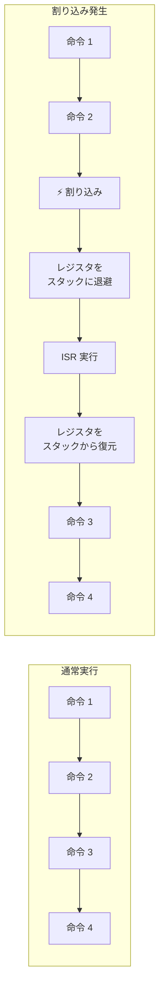
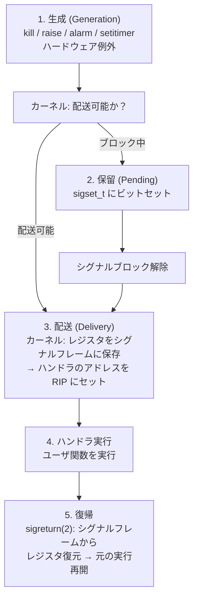

# simsignal — OS の「ソフトウェア割り込み」Signal を C で深く学ぶ（Linux / macOS）

**ソフトウェアエンジニア向けの POSIX シグナル学習教材。**
OS カーネルが提供する「非同期通知機構」であるシグナルを、10 個の段階的なサンプルプログラムで徹底解剖します。ハードウェア割り込み（HW IRQ/ISR）との構造的類似性を軸に、なぜシグナルが「ソフトウェア割り込み」と呼ばれるのかを体得します。

> **核心**: シグナルは「OS カーネルがユーザプロセスに送るソフトウェア割り込み」です。HW 割り込みと 1 対 1 で対応する構造 — 割り込みベクタとシグナル番号、ISR とシグナルハンドラ、割り込み禁止とシグナルマスク — を C コードで可視化します。

---

## TL;DR（3 行で）

1. **シグナルは OS の「非同期割り込み」**。プロセスが自分の意思に関わらず外部から通知を受け取る唯一の標準的な仕組み。
2. **HW 割り込み ISR とシグナルハンドラは構造的に同一** — どちらも「実行中のコンテキストを保存 → ハンドラ実行 → 元のコンテキストへ復帰」のパターンを持つ。
3. **10 個の段階的サンプル**で、`signal()`/`sigaction()`/`sigprocmask()`/`sigaltstack`/リアルタイムシグナルまで体系的に学べる。`make && ./01_signal_basics` から始める。

---

## 目次

1. [学習の到達目標](#学習の到達目標)
2. [前提知識: 割り込みとは何か](#前提知識-割り込みとは何か)
3. [シグナルの本質: ソフトウェア割り込み](#シグナルの本質-ソフトウェア割り込み)
4. [HW 割り込みとシグナルの 1 対 1 対応](#hw-割り込みとシグナルの-1-対-1-対応)
5. [シグナルのライフサイクル](#シグナルのライフサイクル)
6. [シグナル番号一覧と分類](#シグナル番号一覧と分類)
7. [コア API 群](#コア-api-群)
8. [サンプルプログラム一覧](#サンプルプログラム一覧)
9. [コードで追う: 各サンプルの核心](#コードで追う-各サンプルの核心)
10. [難所: 非同期シグナル安全性](#難所-非同期シグナル安全性)
11. [難所: プラットフォーム差](#難所-プラットフォーム差)
12. [ビルド・実行](#ビルド実行)
13. [さらに学ぶために](#さらに学ぶために)

---

## 学習の到達目標

このリポジトリを読み終えると、次が説明できるようになります。

- **シグナルとは何か** — 「プロセスに対する非同期通知」であり、OS がプロセスに割り込む唯一の標準機構であること。
- **HW 割り込みとの対応** — 割り込みベクタ番号 ↔ シグナル番号、ISR ↔ シグナルハンドラ、割り込み禁止（cli/sti）↔ シグナルマスク（`sigprocmask`）、IDT ↔ シグナルテーブル。
- **シグナルのライフサイクル** — 生成（raise/kill/alarm/setitimer）→ 保留（pending）→ 配送（deliver）→ ハンドラ実行 → 復帰、の全ステップ。
- **`sigaction` が `signal()` より優れている理由** — `SA_SIGINFO` で送信元情報取得、`SA_RESTART` でシステムコール再開制御、`SA_ONSTACK` で代替スタック、マスク制御。
- **シグナルマスクの正体** — `sigprocmask` が OS の「割り込み禁止」に相当し、クリティカルセクション保護に使われること。
- **非同期シグナル安全性** — ハンドラ内で `printf`/`malloc`/`mutex` が危険な理由と、安全な関数一覧。
- **リアルタイムシグナルの価値** — キューイングと `si_value` でデータ配送ができること。
- **`sigaltstack` の必要性** — スタックオーバーフロー時に通常スタックが使えない問題と代替スタックの設計。

---

## 前提知識: 割り込みとは何か

シグナルを理解する前に、ハードウェア割り込みの基本を押さえます。割り込みは「CPU が現在実行中の命令ストリームを一時中断し、別のコード（ISR: Interrupt Service Routine）を実行する」仕組みです。



割り込みの特徴：

| 特徴           | 説明                                                           |
|----------------|----------------------------------------------------------------|
| **非同期**     | プログラムの意思に関わらず、任意のタイミングで発生する         |
| **透過的**     | 割り込まれたコードは割り込みの発生に気づかない（レジスタが完全 |
|                | に保存・復元されるため）                                       |
| **優先**       | 通常の命令実行より優先される                                   |
| **ベクタ駆動** | 割り込み番号 → IDT → ISR のアドレス                            |
|                | というルックアップでハンドラが決まる                           |

**HW 割り込みの種類**:

| 割り込み種別         | 発生源                           | 例                                      |
|----------------------|----------------------------------|-----------------------------------------|
| 外部割り込み (IRQ)   | I/O デバイス                     | キーボード押下、NIC                     |
|                      |                                  | パケット受信、ディスク完了              |
| タイマ割り込み       | プログラマブルタイマ (PIT/LAPIC) | スケジューラのタイムスラ                |
|                      |                                  | イス切替（プリエンプション）            |
| 例外 (トラップ)      | CPU 内部                         | ゼロ除算、ページフォールト、不正命令    |
| ソフトウェア割り込み | `int` 命令                       | システムコール (`int 0x80` / `syscall`) |

---

## シグナルの本質: ソフトウェア割り込み

**シグナルとは「カーネルがプロセスに対して発生させるソフトウェア割り込み」**です。

- HW 割り込みが「CPU を中断して ISR を実行する」のに対し、
- シグナルは「プロセスの通常実行を中断してシグナルハンドラを実行する」

ユーザプロセスからは HW 割り込み機構（IDT、IRQ、`cli`/`sti`）に直接触れません。しかしカーネルは、**シグナルという抽象化を通じて、まったく同じ「非同期割り込み」のパターンをユーザ空間に提供**しています。

> **気づき**: `sigaction` でハンドラを登録する行為は、OS の IDT（Interrupt Descriptor Table）に ISR のアドレスを書き込むのと**本質的に同じ**です。

---

## HW 割り込みとシグナルの 1 対 1 対応

この対応表が本教材の核心です。

| 概念                 | HW 割り込み（OS カーネル）                          | POSIX シグナル（ユーザ空間）                                                     | 備考                                           |
|----------------------|-----------------------------------------------------|----------------------------------------------------------------------------------|------------------------------------------------|
| **割り込み源**       | デバイス / タイマ / CPU 例外                        | `kill(2)`, `raise(3)`, `alarm(2)`, `setitimer(2)`, ハードウェア例外（SIGSEGV等） | シグナルはカーネルが生成する                   |
| **割り込み番号**     | 割り込みベクタ番号（0-255）                         | シグナル番号（1-31 標準, 34-64 リアルタイム）                                    | どちらも整数でハンドラをルックアップ           |
| **ハンドラテーブル** | IDT（Interrupt Descriptor Table）                   | プロセスごとの `sigaction` テーブル                                              | カーネル内の `task_struct.sighand`             |
| **ハンドラ**         | ISR（Interrupt Service Routine）                    | シグナルハンドラ関数                                                             | ど                                             |
|                      |                                                     |                                                                                  | ちらも「割り込まれたコンテキスト」とは別に実行 |
| **コンテキスト保存** | CPU が自動で SS:RSP/RFLAGS/CS:RIP をスタックに push | カーネルが `ucontext_t` に全レジスタを保存                                       | シグナルフレームに保存される                   |
| **復帰命令**         | `iret`（x86）/ `eret`（ARM）                        | `sigreturn(2)`（カーネルが自動呼出）                                             | 保存したコンテキストを復元して再開             |
| **割り込み禁止**     | `cli` 命令（Clear Interrupt Flag）                  | `sigprocmask(SIG_BLOCK, ...)`                                                    | クリティカルセクションの保護                   |
| **割り込み許可**     | `sti` 命令（Set                                     | `sigprocmask(SIG_UNBLOCK, ...)`                                                  | —                                              |
|                      | Interrupt Flag）                                    |                                                                                  |                                                |
| **割り込み優先度**   | IRQ 優先度 (PIC/APIC)                               | （標準シグナルには優先度なし、リアルタイムシグナル間のみ FIFO）                  | シグナル到着順は保証されない                   |
| **割り込みネスト**   | 可能（higher-priority IRQ が lower に割り込む）     | デフォルトで同一シグナルはブロック（`SA_NODEFER` で変更可）                      | シグナルハンドラ実行中は同シグナルが自動マスク |
| **NMI**              | Non-Maskable Interrupt（`cli` でも止まらない）      | `SIGKILL` / `SIGSTOP`（キャッチ不可、ブロック不可）                              | プロセスに拒否できないシグナル                 |

---

## シグナルのライフサイクル

シグナルは「生成 → 保留 → 配送 → 処理 → 復帰」の 5 段階を経ます。



**配送のタイミング**: シグナルは「生成された瞬間」ではなく、カーネルが**ユーザ空間へ戻るタイミング**（システムコールの戻りやタイマ割り込みからの復帰）で配送されます。ブロック中のシグナルは `pending` ビットが立ったまま待機します。

### 配送の詳細: カーネル内部で何が起きているか

1. カーネルがユーザ空間に戻る直前に `do_signal()` を呼ぶ
2. `pending` ビットマスクと `blocked` マスクから「配送すべきシグナル」を決定
3. 配送する場合：
   - ユーザスタックに **シグナルフレーム**（`ucontext_t` + `siginfo_t` + リターンアドレス）を構築
   - プロセスの `RIP` をシグナルハンドラのアドレスに書き換え
   - ユーザ空間に戻ると、プロセスは**突然ハンドラの先頭から実行を始める**
4. ハンドラが `return` すると、スタックに仕込まれた `sigreturn(2)` が呼ばれ、元のコンテキストが復元される

> **ポイント**: ステップ 3 は、HW 割り込みで CPU が `RIP` を IDT 経由で ISR のアドレスに差し替えるのと、まったく同じ構造です。違いは「誰が RIP を書き換えるか」（CPU vs カーネル）だけ。

---

## シグナル番号一覧と分類

### 標準シグナル (1-31)

| 番号 | シンボル    | デフォルト動作 | 説明                                    | キャッチ/無視/ブロック |
|------|-------------|----------------|-----------------------------------------|------------------------|
| 1    | `SIGHUP`    | Term           | 制御端末のハングアップ                  | 可                     |
| 2    | `SIGINT`    | Term           | キーボード割り込み (Ctrl+C)             | 可                     |
| 3    | `SIGQUIT`   | Core           | キーボード quit (Ctrl+\\)               | 可                     |
| 4    | `SIGILL`    | Core           | 不正命令                                | 可                     |
| 5    | `SIGTRAP`   | Core           | トレース/ブレークポイント               | 可                     |
| 6    | `SIGABRT`   | Core           | abort(3) による異常終了                 | 可                     |
| 7    | `SIGBUS`    | Core           | バスエラー（不正メモリアクセス）        | 可                     |
| 8    | `SIGFPE`    | Core           | 浮動小数点例外                          | 可                     |
| 9    | `SIGKILL`   | Term           | **強制終了（キャッチ不可）**            | **不可**               |
| 10   | `SIGUSR1`   | Term           | ユーザ定義シグナル 1                    | 可                     |
| 11   | `SIGSEGV`   | Core           | 不正メモリ参照（segfault）              | 可                     |
| 12   | `SIGUSR2`   | Term           | ユーザ定義シグナル 2                    | 可                     |
| 13   | `SIGPIPE`   | Term           | 読み手のいないパイプへの書き込み        | 可                     |
| 14   | `SIGALRM`   | Term           | alarm(2) / setitimer による実時間タイマ | 可                     |
| 15   | `SIGTERM`   | Term           | 終了要求（デフォルトの kill）           | 可                     |
| 16   | `SIGSTKFLT` | Term           | コプロセッサスタックフォールト          | 可                     |
| 17   | `SIGCHLD`   | Ign            | 子プロセスの停止/終了                   | 可                     |
| 18   | `SIGCONT`   | Cont           | 停止中のプロセスを再開                  | 可                     |
| 19   | `SIGSTOP`   | Stop           | **実行停止（キャッチ不可）**            | **不可**               |
| 20   | `SIGTSTP`   | Stop           | 端末からの停止 (Ctrl+Z)                 | 可                     |
| 21   | `SIGTTIN`   | Stop           | バックグラウンドプロセスの端末読み取り  | 可                     |
| 22   | `SIGTTOU`   | Stop           | バックグラウンドプロセスの端末書き込み  | 可                     |
| 23   | `SIGURG`    | Ign            | ソケットの緊急データ                    | 可                     |
| 24   | `SIGXCPU`   | Core           | CPU 時間制限超過                        | 可                     |
| 25   | `SIGXFSZ`   | Core           | ファイルサイズ制限超過                  | 可                     |
| 26   | `SIGVTALRM` | Term           | setitimer による仮想（CPU）時間タイマ   | 可                     |
| 27   | `SIGPROF`   | Term           | プロファイリングタイマ                  | 可                     |
| 28   | `SIGWINCH`  | Ign            | 端末ウィンドウサイズ変更                | 可                     |
| 29   | `SIGIO`     | Term           | 非同期 I/O イベント                     | 可                     |
| 30   | `SIGPWR`    | Term           | 電源障害                                | 可                     |
| 31   | `SIGSYS`    | Core           | 不正システムコール                      | 可                     |

### リアルタイムシグナル (`SIGRTMIN`〜`SIGRTMAX`)

- **番号範囲**: Linux では 34〜64（`SIGRTMIN+n`）
- **最大の利点**: **キューイング** — 同じシグナルを複数回送っても 1 つにまとめられず、到着順に保持される
- **データ配送**: `sigqueue(2)` で `union sigval` の整数またはポインタを送れる。ハンドラは `siginfo_t.si_value` で受け取る
- **配送順序**: 番号の小さいリアルタイムシグナルが優先される（標準シグナルには順序保証なし）

### デフォルト動作の種類

| 動作     | 意味                      |
|----------|---------------------------|
| **Term** | プロセス終了              |
| **Ign**  | 無視                      |
| **Core** | プロセス終了 + コアダンプ |
| **Stop** | プロセス実行停止          |
| **Cont** | 停止中プロセスの実行再開  |

---

## コア API 群

### ハンドラ登録

```c
// 古い（使うべきでない）API — プラットフォーム間で動作が異なる
void (*signal(int signum, void (*handler)(int)))(int);

// 推奨される API
int sigaction(int signum,
              const struct sigaction *act,
              struct sigaction *oldact);
```

`sigaction` の構造体:

```c
struct sigaction {
    void     (*sa_handler)(int);        // ハンドラ（SIG_IGN, SIG_DFL, または関数）
    void     (*sa_sigaction)(int, siginfo_t *, void *);  // SA_SIGINFO 用
    sigset_t   sa_mask;                 // ハンドラ実行中に追加ブロックするシグナル
    int        sa_flags;                // 動作フラグ
};
```

| `sa_flags`     | 効果                                                          |
|----------------|---------------------------------------------------------------|
| `SA_SIGINFO`   | `sa_sigaction` を使用。`siginfo_t` で送信元                   |
|                | PID/UID/原因を取得                                            |
| `SA_RESTART`   | シグナルで中断されたシステムコールを自動再開                  |
| `SA_ONSTACK`   | `sigaltstack(2)` で設定した代替スタックでハンドラを実行       |
| `SA_NODEFER`   | ハンドラ実行中の同一シグナル自動ブロックを**無効化**（re-entr |
|                | ant になる）                                                  |
| `SA_RESETHAND` | ハンドラ実行後、自動で `SIG_DFL` に戻す（System V 互換）      |
| `SA_NOCLDSTOP` | `SIGCHLD` で子の停止時に通知しない                            |
| `SA_NOCLDWAIT` | `SIGCHLD` で子をゾンビ化しない                                |

### シグナルマスク操作

```c
// ブロックするシグナルの集合を操作
int sigprocmask(int how, const sigset_t *set, sigset_t *oldset);
// how: SIG_BLOCK / SIG_UNBLOCK / SIG_SETMASK
// シグナルセット操作
int sigemptyset(sigset_t *set);
int sigfillset(sigset_t *set);
int sigaddset(sigset_t *set, int signum);
int sigdelset(sigset_t *set, int signum);
int sigismember(const sigset_t *set, int signum);

// 保留中のシグナルを取得（ブロック中に届いたもの）
int sigpending(sigset_t *set);
```

### シグナル送信

```c
int kill(pid_t pid, int sig);              // 他プロセスに送信
int raise(int sig);                        // 自分自身に送信 (= kill(getpid(), sig))
int sigqueue(pid_t pid, int sig,           // リアルタイムシグナル + データ送信
             const union sigval value);
int pthread_kill(pthread_t thread, int sig);  // 特定スレッドに送信
```

### タイマによる定周期シグナル

```c
unsigned int alarm(unsigned int seconds);   // 単発タイマ（秒単位・粗粒度）
int setitimer(int which,                    // 高精度反復タイマ
              const struct itimerval *new,
              struct itimerval *old);
// which: ITIMER_REAL → SIGALRM, ITIMER_VIRTUAL → SIGVTALRM, ITIMER_PROF → SIGPROF
int timer_create(...)  // POSIX 高精度タイマ（Linux: hrtimer 基盤）
```

### 代替スタック

```c
int sigaltstack(const stack_t *ss, stack_t *old_ss);
// SA_ONSTACK と併用。スタックオーバーフロー時に通常スタックの代わりに使う
```

---

## サンプルプログラム一覧

10 個の段階的なサンプル。番号順に読むと体系的な理解が得られます。

| #  | ファイル           | 学べること                                                      | キーワード                                  |
|----|--------------------|-----------------------------------------------------------------|---------------------------------------------|
| 01 | `01_signal_basics` | `signal()`, `raise()`,                                          | signal, raise, SIGINT                       |
|    |                    | `SIG_IGN`, `SIG_DFL`, シグナルの基本                            |                                             |
| 02 | `02_sigaction`     | `sigaction()`,                                                  | sigaction, siginfo_t, SA_SIGINFO            |
|    |                    | `SA_SIGINFO`, `siginfo_t` で送信元情報取得                      |                                             |
| 03 | `03_blocking`      | `sigprocmask`,                                                  | sigprocmask, sigpending, SIG_BLOCK          |
|    |                    | シグナルブロック, `sigpending`, クリティカルセクション          |                                             |
| 04 | `04_timer`         | `alarm()`,                                                      | alarm, setitimer, SIGALRM, SIGVTALRM        |
|    |                    | `setitimer()`, タイマシグナルの実時間/仮想時間/プロファイル時間 |                                             |
| 05 | `05_altstack`      | `sigaltstack`, `SA_ONSTACK`,                                    | sigaltstack, SA_ONSTACK                     |
|    |                    | スタックオーバーフロー時の代替スタック                          |                                             |
| 06 | `06_realtime`      | リアルタイムシグナル、`s                                        | SIGRTMIN, sigqueue, si_value                |
|    |                    | igqueue`、キューイング、`si_value` データ配送                   |                                             |
| 07 | `07_selfpipe`      | Self-pipe trick — シグナルを                                    | pipe, select, self-pipe                     |
|    |                    | `select`/`poll` イベントループに統合                            |                                             |
| 08 | `08_hw_interrupt`  | **HW                                                            | ISR, IDT, ucontext_t, setcontext, sigaction |
|    |                    | 割り込み ISR とシグナルハンドラの構造的同一性を実証**           |                                             |
| 09 | `09_fork_exec`     | `fork`/`exec`                                                   | fork, exec, sigprocmask                     |
|    |                    | でのシグナルマスクとハンドラの継承                              |                                             |
| 10 | `10_signal_safety` | 非同期シグナル安全                                              | async-signal-safe, volatile                 |
|    |                    | — ハンドラ内で安全に呼べる関数、volatile sig_atomic_t           |                                             |

---

## コードで追う: 各サンプルの核心

### 01_signal_basics — シグナルの基本

```c
// シグナルハンドラの登録（古い API）
signal(SIGINT, handler);

// ハンドラ内
void handler(int sig) {
    write(STDOUT_FILENO, "Caught SIGINT!\n", 15);
}
```

**ポイント**:
- `signal()` はプラットフォーム間で動作が異なる（System V: ワンショット、BSD: 永続）。**新規コードでは `sigaction` を使う**。
- ハンドラ内では `printf` でなく `write` を使う（`printf` は async-signal-safe でない）

### 02_sigaction — モダンなハンドラ登録

```c
struct sigaction sa;
sa.sa_sigaction = handler;       // SA_SIGINFO と併用
sa.sa_flags = SA_SIGINFO;        // siginfo_t で詳細情報を取得
sigemptyset(&sa.sa_mask);
sigaction(SIGINT, &sa, NULL);

void handler(int sig, siginfo_t *info, void *ucontext) {
    // info->si_pid  : 送信元プロセスの PID
    // info->si_uid  : 送信元プロセスの UID
    // info->si_code : シグナル発生原因コード
    // ucontext      : 割り込まれたコンテキストの全レジスタ状態
}
```

### 03_blocking — シグナルマスク（= 割り込み禁止）

```c
sigset_t set;
sigemptyset(&set);
sigaddset(&set, SIGINT);
sigprocmask(SIG_BLOCK, &set, NULL);   // SIGINT をブロック（= cli）
// ... クリティカルセクション ...
sigprocmask(SIG_UNBLOCK, &set, NULL); // SIGINT を許可（= sti）

// ブロック中に届いたシグナルは？
sigset_t pending;
sigpending(&pending);                 // 保留中のシグナルを取得
if (sigismember(&pending, SIGINT)) {
    // SIGINT がブロック中に届いていた
}
```

**OS のアナロジー**: `sigprocmask(SIG_BLOCK)` は `cli`（割り込み禁止）、`sigprocmask(SIG_UNBLOCK)` は `sti`（割り込み許可）に完全対応。

### 04_timer — タイマシグナル

```c
// alarm(2): 単発・秒単位
alarm(2);  // 2秒後に SIGALRM → ハンドラが1回呼ばれる

// setitimer(2): 高精度反復タイマ
struct itimerval it;
it.it_interval.tv_sec  = 0;    // 反復間隔
it.it_interval.tv_usec = 500000;  // 500ms
it.it_value = it.it_interval;

setitimer(ITIMER_REAL, &it, NULL);    // → SIGALRM（実時間）
setitimer(ITIMER_VIRTUAL, &it, NULL); // → SIGVTALRM（CPU時間のみ）
setitimer(ITIMER_PROF, &it, NULL);    // → SIGPROF（CPU時間 + カーネル時間）
```

| タイマ           | シグナル    | 計測する時間               |
|------------------|-------------|----------------------------|
| `ITIMER_REAL`    | `SIGALRM`   | 実時間（wall clock）       |
| `ITIMER_VIRTUAL` | `SIGVTALRM` | ユーザモード CPU 時間のみ  |
| `ITIMER_PROF`    | `SIGPROF`   | ユーザ + カーネル CPU 時間 |

> `ITIMER_VIRTUAL` は **HW プログラマブルタイマのソフトウェア代替**として最重要。`../threading` リポジトリではこれでプリエンプションを駆動する。

### 05_altstack — 代替スタック

```c
stack_t ss;
ss.ss_sp = malloc(SIGSTKSZ);   // 代替スタック用メモリ
ss.ss_size = SIGSTKSZ;
ss.ss_flags = 0;
sigaltstack(&ss, NULL);

struct sigaction sa;
sa.sa_flags = SA_ONSTACK;       // このハンドラは代替スタックで実行
sigaction(SIGSEGV, &sa, NULL);
```

**なぜ必要か**: スタックオーバーフローを起こしたとき、通常スタックは枯渇している。`SIGSEGV` ハンドラを実行するスタックすら確保できないため、**別のメモリ領域**を代替スタックとして用意する。これは OS の「割り込み用カーネルスタック」と同じ設計思想。

### 06_realtime — リアルタイムシグナル

```c
union sigval value;
value.sival_int = 42;
sigqueue(pid, SIGRTMIN, value);  // 整数データ付きで送信

void handler(int sig, siginfo_t *info, void *ucontext) {
    int data = info->si_value.sival_int;  // 42 を受け取る
}
```

- 標準シグナルは**複数回到着しても 1 回しか配送されない**（マージされる）
- リアルタイムシグナルは**キューイング**され、すべて配送される
- `sigqueue` でデータを添付できる（プロセス間通信に使える）

### 07_selfpipe — Self-pipe trick

```c
// パイプを作成
int selfpipe[2];
pipe(selfpipe);

// シグナルハンドラ: パイプに 1 バイト書き込むだけ
void handler(int sig) {
    char c = (char)sig;
    write(selfpipe[1], &c, 1);
}

// メインループ: select/poll/epoll でパイプを監視
fd_set fds;
FD_ZERO(&fds);
FD_SET(selfpipe[0], &fds);
select(selfpipe[0] + 1, &fds, NULL, NULL, NULL);

// パイプが読み取り可能 → シグナルが届いた
char c;
read(selfpipe[0], &c, 1);
// c がシグナル番号
```

**なぜ必要か**: `select`/`poll`/`epoll` はファイルディスクリプタのイベントしか監視できない。しかしシグナルは FD イベントではない。self-pipe trick は「シグナル到着」を「パイプへの書き込み」に変換することで、シグナルと I/O イベントを**単一のイベントループ**で統一的に扱えるようにする古典的なパターン。Linux では `signalfd(2)` がネイティブにこれを実現するが、POSIX では self-pipe が最もポータブル。

### 08_hw_interrupt — HW 割り込みとの構造的同一性（核心）

このサンプルが本リポジトリの目玉です。`SIGVTALRM` ハンドラに、**`ucontext_t` を介したコンテキストの保存・切替**を実装し、以下の 1 対 1 対応を実証します：

```c
// ISR とシグナルハンドラの比較

// === HW 割り込みの流れ ===
// 1. CPU: レジスタをスタックに push
// 2. CPU: IDT[vector] → ISR アドレス
// 3. ISR 実行
// 4. iret: スタックから復元して元の実行を継続

// === シグナルハンドラの流れ ===
// 1. カーネル: レジスタを ucontext_t に保存
// 2. カーネル: sigaction テーブル → ハンドラアドレス
// 3. ハンドラ実行
// 4. sigreturn: ucontext_t から復元して元の実行を継続

void sigvtalrm_ISR(int sig, siginfo_t *info, void *uctx_ptr) {
    ucontext_t *interrupted = (ucontext_t *)uctx_ptr;

    // interrupted の中に全レジスタが入っている
    // = HW 割り込みでのトラップフレームに相当

    // ここでスケジューラを実行（＝ OS の ISR と同じパターン）
    // ...
    // 別のコンテキストへ setcontext することも可能
    // → これがプリエンプションの正体
}
```

**このサンプルが示す核心的事実**:
1. シグナルハンドラの第3引数 `void *uctx` は「割り込まれた瞬間の全CPU状態」
2. これは HW 割り込みで CPU が自動保存するトラップフレームと**完全に等価**
3. 「ハンドラが `setcontext` で別のコンテキストへ移行する」ことは「ISR が `iret` で別タスクへ復帰する」のと**同じ意味**

つまり、**POSIX シグナルは「ユーザ空間で使えるソフトウェア割り込み機構」であり、その構造は HW 割り込みと完全に相同**です。

### 09_fork_exec — シグナル継承

```c
pid_t pid = fork();
if (pid == 0) {
    // 子プロセス
    // fork 後: シグナルマスクとハンドラは親から継承される
    // exec 後: ハンドラは SIG_DFL/SIG_IGN にリセット（SIG_IGN は継承）
    // マスク: 親から継承（exec 後も変わらない）
}
```

| 属性             | `fork()` 後                        | `exec()` 後                                  |
|------------------|------------------------------------|----------------------------------------------|
| シグナルハンドラ | 親と同じ                           | `SIG_DFL` にリセット（`SIG_IGN` だけは継承） |
| シグナルマスク   | 親と同じ                           | 親と同じ                                     |
| 保留シグナル     | クリア                             | 継承                                         |
| `sigaltstack`    | 親と同じ                           | クリア                                       |
| `itimerval`      | 親と同じ（`ITIMER_REAL`            | クリア                                       |
|                  | 以外は継承？プラットフォーム依存） |                                              |

### 10_signal_safety — 非同期シグナル安全

```c
// 安全: write(2), _exit(2), signal/sigaction の単純な再設定
// 安全: sigprocmask, sigemptyset, sigaddset
// 安全: volatile sig_atomic_t 変数のみ読み書き

volatile sig_atomic_t got_signal = 0;

void safe_handler(int sig) {
    got_signal = 1;  // OK: sig_atomic_t で宣言されている
}

// 危険（やってはいけない）:
void unsafe_handler(int sig) {
    printf("got %d\n", sig);  // NG: printf はロックを持つ
    malloc(100);              // NG: malloc はロックを持つ
    exit(1);                  // NG: exit は stdio バッファをフラッシュする（_exit なら安全）
}
```

| 安全な関数の代表例               | 危険な関数の代表例                         |
|----------------------------------|--------------------------------------------|
| `_exit()`                        | `exit()`                                   |
| `write()`                        | `printf()` / `fprintf()`                   |
| `sigprocmask()`                  | `pthread_mutex_lock()`                     |
| `sigaction()` / `signal()`       | `malloc()` / `free()`                      |
| `abort()`                        | `setjmp()` / `longjmp()`                   |
| `kill()` / `raise()`             | すべての stdio 系 (`fopen`, `fclose`, ...) |
| `volatile sig_atomic_t` 変数のみ | 通常のグローバル変数                       |

---

## 難所: 非同期シグナル安全性

非同期シグナル安全（async-signal-safety）は、シグナルを使う上で最も重要な概念です。

### なぜシグナルハンドラ内で printf を呼んではいけないのか

```c
// 危険なコード（デッドロックの可能性）
void handler(int sig) {
    printf("Caught signal %d\n", sig);  // ← デッドロック！
}

int main() {
    signal(SIGINT, handler);
    // main が printf 実行中に SIGINT が来ると...
    printf("Hello, ");  // ← 内部で stdout のロックを保持中
    // → ハンドラが printf を呼ぶ → 同じロックを取ろうとしてデッドロック
}
```

**何が起きているか**:
1. `main` が `printf("Hello, ")` の途中 — `stdout` の内部ロックを保持している
2. ここで `SIGINT` が到着 → カーネルがハンドラを起動
3. ハンドラが `printf("Caught...")` を呼ぶ → `printf` 内で再び `stdout` のロックを取ろうとする
4. ロックは `main` の `printf` が保持したまま → **デッドロック**

### 安全に書く方法

```c
volatile sig_atomic_t flag = 0;

void safe_handler(int sig) {
    flag = sig;  // 安全: sig_atomic_t の代入は不可分
}

int main() {
    // ...
    if (flag != 0) {
        // メインループで安全に処理
        int sig = flag;
        flag = 0;
        printf("Caught signal %d\n", sig);  // メインコンテキストなら安全
    }
}
```

### sig_atomic_t の意味

`volatile sig_atomic_t` は「シグナルハンドラと通常実行の間で安全に共有できる唯一の型」です。

- `sig_atomic_t`: 読み書きが不可分（atomic）であることを保証する整数型
- `volatile`: コンパイラに「この変数は最適化しないで」と指示（ハンドラ内の変更をメイン側が見逃さないため）
- 保証されること: この型の変数への読み書きは、シグナルで途中で割り込まれても破綻しない

---

## 難所: プラットフォーム差

### Linux vs macOS で注意すべき点

| 項目                          | Linux (glibc)               | macOS (Darwin)                         |
|-------------------------------|-----------------------------|----------------------------------------|
| `signal()` 動作               | BSD セマンティクス（永続）  | BSD セマンティクス（永続）             |
| `ucontext_t` の `uc_mcontext` | 埋め込み構造体（glibc）     | **ポインタ**（`mco                     |
|                               |                             | ntext_t` への）                        |
| リアルタイムシグナル範囲      | `SIGRTMIN` = 34（可変）     | サポートされているが実                 |
|                               |                             | 装依存                                 |
| `signal.h` vs `sys/signal.h`  | `signal.h` で十分           | `sys/signal.h` が古い                  |
|                               |                             | API も提供                             |
| `timer_create` 精度           | hrtimer 基盤（ns 精度）     | kqueue タイマ（µs 精度）               |
| `signalfd`                    | 利用可能                    | **存在しない**（self-pipe trick 使用） |
| 非同期 I/O シグナル           | `SIGIO` (`fcntl(F_SETOWN)`) | 部分的サポート（`F_SETOW               |
|                               |                             | N` のシグナルが異なる可能性）          |

### シグナル番号の互換性

標準シグナル（1-31）は POSIX で定義されているため、番号はプラットフォーム間で共通です。ただし一部はアーキテクチャ依存で異なる場合があります（SIGSTKFLT、SIGPWR など）。**コードでは番号でなくシンボル（`SIGINT` など）を使う**べきです。

---

## ビルド・実行

```sh
# 全サンプルをビルド
make

# 順に実行
./01_signal_basics
./02_sigaction
./03_blocking
./04_timer
./05_altstack
./06_realtime     # Linux 推奨（リアルタイムシグナル）
./07_selfpipe
./08_hw_interrupt # ★核心：HW割り込みとの構造的同一性
./09_fork_exec
./10_signal_safety

# クリーン
make clean
```

### カーネルシグナル送信を試す

```sh
# 別ターミナルからシグナルを送ってみる
./01_signal_basics &     # バックグラウンドで起動
kill -USR1 $!            # SIGUSR1 を送信
kill -INT $!             # SIGINT を送信
kill -TERM $!            # SIGTERM を送信
kill -KILL $!            # SIGKILL（キャッチ不可）
```

---

## さらに学ぶために

1. **本リポジトリのサンプル** — 01→10 の順に読む。特に 08 が核心。
2. **`../threading`** — 本リポジトリで学んだシグナルを土台に、プリエンプティブ・スレッドをユーザ空間で実装する教材。`SIGVTALRM` + `setitimer` をタイマ割り込みとして使う。
3. **`man 7 signal`** — Linux のシグナル概要マニュアル。
4. **`man 7 signal-safety`** — 非同期シグナル安全な関数の完全な一覧。
5. **Linux カーネルソース**:
   - `arch/x86/kernel/signal.c` — シグナルフレーム構築の実装
   - `kernel/signal.c` — シグナル配送のコアロジック（`do_signal` など）
   - `arch/x86/entry/entry_64.S` — `iret` と `sysret` のアセンブリ
6. **OS 教科書**: OSTEP（*Operating Systems: Three Easy Pieces*）"Interrupts" の章
7. **Intel SDM Vol.3 Chapter 6**: 割り込みと例外のハードウェア仕様。IDT、IRQ、割り込みスタックの詳細。
8. **APUE (Stevens)**: *Advanced Programming in the UNIX Environment* Chapter 10（Signals）— 古典的だが完全なリファレンス。

---

## リポジトリ構成

```
signal/
  README.md                 本ファイル（主教材）
  Makefile                  全サンプルのビルドルール
  .clang-format             C コードフォーマット設定（Google style 4-spaces）
  .gitignore                ビルド生成物とエディタファイル
  examples/
    01_signal_basics.c      シグナルの基本: signal(), raise(), SIG_IGN, SIG_DFL
    02_sigaction.c          sigaction, siginfo_t, SA_SIGINFO
    03_blocking.c           sigprocmask, ブロック, sigpending
    04_timer.c              alarm, setitimer, タイマシグナル
    05_altstack.c           sigaltstack, SA_ONSTACK
    06_realtime.c           リアルタイムシグナル, sigqueue
    07_selfpipe.c           Self-pipe trick
    08_hw_interrupt.c       HW割り込みISRとシグナルハンドラの構造的同一性
    09_fork_exec.c          fork/exec でのシグナル継承
    10_signal_safety.c      非同期シグナル安全
```
